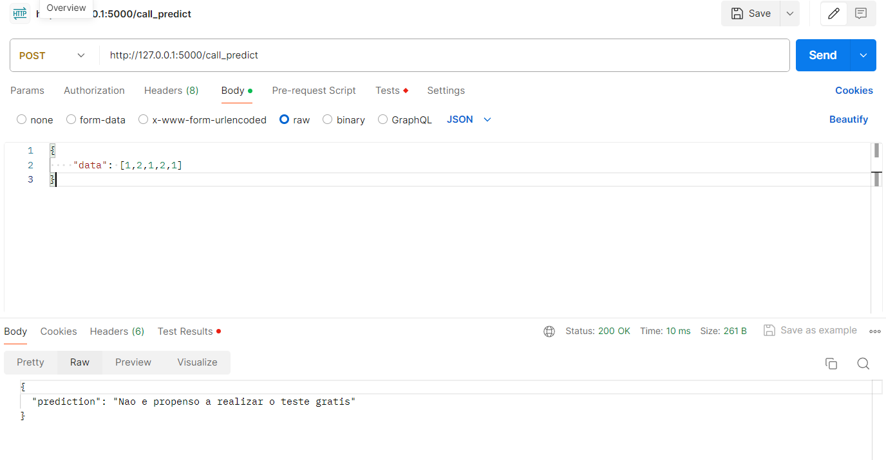
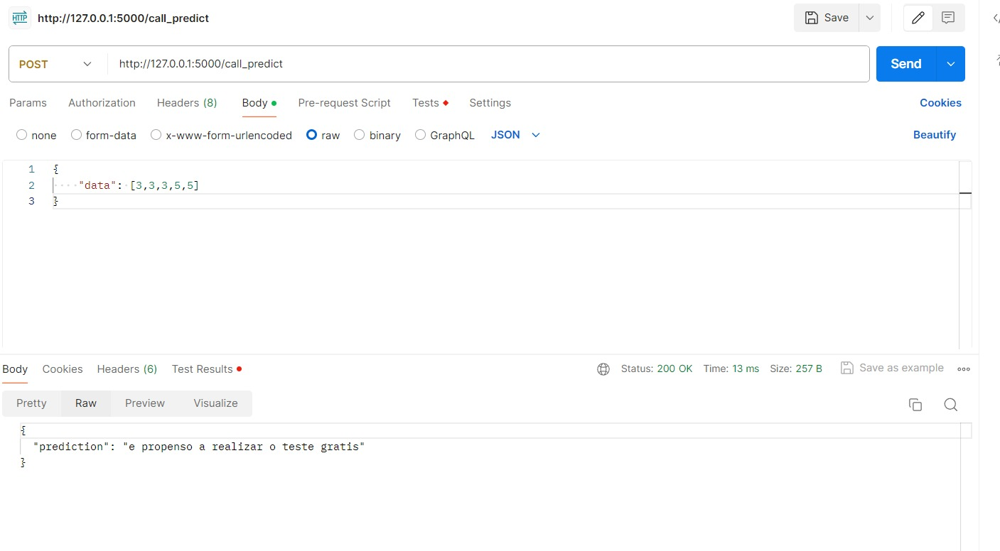

# Sprint 4 ChatBotIA

## Descrição

Esta aplicação é um sistema de predição feito utilizando Machine Learning que determina se um usuário é propenso a realizar um teste grátis.

O arquivo `main.ipynb` é um Jupyter Notebook que contém a análise exploratória dos dados e o treinamento do modelo de machine learning. Ele inclui visualizações de dados, pré-processamento de dados, seleção de modelo, treinamento de modelo e avaliação de modelo.

O arquivo `server.py` é o servidor principal que recebe as solicitações HTTP, faz as previsões usando o modelo treinado e retorna as respostas.

## Instalação

Para instalar e executar a aplicação, siga os seguintes passos:

1. Clone o repositório: `git clone https://github.com/nemcolas/sprint4ChatbotIA`
2. Entre no diretório do projeto: `cd sprint4ChatbotIA`
3. Instale as dependências do projeto: `pip install -r requirements.txt`
4. Execute a aplicação: `python server.py`

## Uso

Para usar a aplicação, faça uma solicitação POST para a rota `/call_predict`. Você pode fazer isso utilizando uma ferramenta como o Postman ou sua biblioteca de solicitação HTTP preferida. No corpo da solicitação, inclua o JSON com os dados de entrada esperado.

exemplo de solicitação:

```bash
"data": [1,2,1,2,1]



```bash
"data:[3,3,3,5,5]



